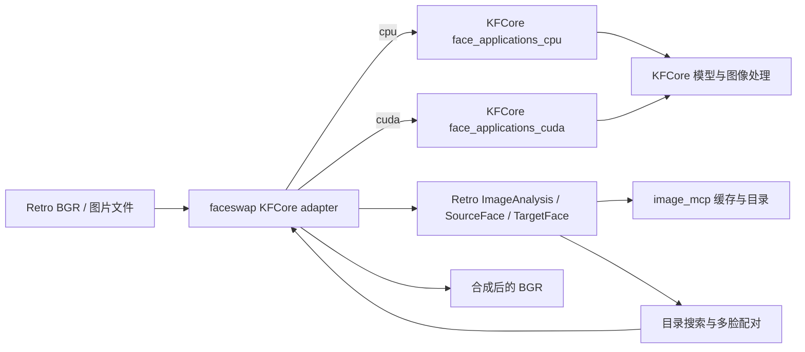

# Faceswap 统一迁移到 KFCore 设计

## 背景

Retro 的 `faceswap` 与 `image_mcp` 当前直接创建 ONNX Runtime 会话，并分别维护检测、
68 点、ArcFace、InSwapper、GFPGAN 和年龄性别模型。KFCore 已经提供对应的 CPU/ONNX
与 CUDA/TensorRT 模型实现，但现有应用层只暴露单脸 `analyze` 和“重新分析源图与目标图”
的 `swap`，无法保持 `image_mcp` 的多脸目录、分析缓存和预先计算 embedding/landmarks 的
业务行为。

本次迁移以 KFCore 为模型执行的唯一事实源，同时保持 Retro 的人脸目录、缓存格式、搜索、
多脸配对和用户可见换脸流程。

## 目标与非目标

目标：

- `face_applications_cpu` 与 `face_applications_cuda` 提供对等的全脸分析接口。
- 两个后端都能用调用方提供的 512 维源 embedding 和目标 5 点执行换脸，并可逐次决定是否增强。
- Retro 的 provider 选择仍为 `cpu` 或 `cuda`；不做静默降级。
- `faceswap`/`image_mcp` 不再直接链接 ONNX Runtime 或 Eigen，也不再自行执行模型。
- 保持 `image_mcp` 的多脸结果、缓存文件内容、目录搜索和按目标顺序连续合成行为。

非目标：

- 不改变 HTTP/MCP 协议、缓存 JSON/BIN 格式或数据库 schema。
- 不引入新 provider；DirectML 在新 KFCore 应用边界上明确拒绝。
- 不改变模型数学定义、阈值默认值或模板匹配策略。

## 现状证据

- KFCore CPU 应用通过 `CpuFaceDetector`、Face68、ArcFace、InSwapper、GFPGAN 组成流水线，
  但检测解码只保留最高分人脸。
- KFCore CUDA 应用的 TensorRT detector 已返回 `DetectionFrame::detections`，应用层同样只
  选择最高分人脸。
- Retro `image_mcp::Analyze` 遍历所有检测框，分别生成 68 点、5 点、embedding 与人口属性；
  `SwapMultipleFaces` 使用缓存的 embedding/landmarks 顺序合成。
- Retro `faceswap` 目标当前直接链接 `onnxruntime` 与 `Eigen3::Eigen`。

## 候选方案

### A. Retro 直接组合 KFCore 的底层模型

优点是迁移表面较小。缺点是 Retro 会继续拥有预处理、后处理、embedding 投影、遮罩合成和
CPU/CUDA 差异，形成第二套模型应用实现，不满足唯一事实源目标。

### B. 扩展 KFCore 应用层并由 Retro 使用薄适配器（选择）

KFCore 对 CPU/CUDA 分别提供全脸分析与 prepared swap。Retro 只转换图像和领域结构，保留
目录/缓存/搜索编排。模型路径、模型契约、预处理、推理与合成均归 KFCore。

代价是 KFCore 增加公开 API，两个后端必须同步维护；收益是模型行为和错误边界集中，Retro
可移除直接推理依赖。

### C. 让 Retro 只调用现有 `swap(source, target)`

接口最少，但每个目标会重复检测和提取源 embedding，且无法使用目录缓存的 embedding 和
模板 landmarks；多脸目标也无法指定配对。因此不采用。

## 选定架构

### KFCore 接口

两个后端保持各自强类型结果，但提供同一语义：

- `analyze_all(image)`：按检测器输出稳定顺序返回全部满足 class/score 条件的人脸；没有人脸时
  返回空 vector，不抛 `NoFaceDetected`。
- `analyze(image)`：兼容现有行为，从 `analyze_all` 选择最高分，空结果抛 `NoFaceDetected`。
- `swap_prepared(target, source_embedding, target_landmarks, enhance)`：输入均为 borrowed/value；
  512 维 embedding 与 5 点必须有限，`enhance=true` 但未配置 GFPGAN 时 fail fast。
- 现有 `swap(source, target)` 保持行为，内部复用 prepared 路径；配置了 GFPGAN 时仍默认增强。

CPU detector 增加全检测结果类型；旧 `infer` 继续返回最高分，以保持 FaceMesh 等调用方兼容。
CUDA 直接复用已有 `DetectionFrame`。

### Retro 适配层

`NetworkManager` 仍是调用方生命周期入口，但其核心状态改为一个且仅一个 KFCore CPU 或 CUDA
应用实例。新增的领域级方法承担：

- `AnalyzeAll`：把 KFCore 结果转换为现有 `ImageAnalysis` 所需的 bbox、68 点、5 点、embedding、
  age/gender 原始值。
- `SwapPrepared`：把现有 source embedding 与 target landmarks 传给 KFCore。

旧的单模型 accessors 与 pool 不能在不重新暴露底层模型的情况下保持语义；仓库内调用方迁移到
上述领域接口后移除。并行由调用方持有多个 `NetworkManager` 实例表达，不在一个非重入应用实例
内伪造模型池。

## 状态、所有权与线程模型

- 模型会话/engine 的唯一 owner 是 `NetworkManager` 内的 KFCore 应用实例。
- 每次调用的图像为 borrowed view；返回的 BGR、分析数组与 embedding 为 owned value。
- 应用实例同步且不可重入；并行任务必须使用独立实例，避免共享 CUDA scratch buffer 或 ONNX
  session adapter 状态。
- `image_mcp` 缓存仍是派生数据，模型输出是重建来源；缓存失效规则和格式不变。

## 错误语义

- 配置、路径、模型契约、尺寸、非有限值和 provider 不支持在边界处 fail fast。
- `analyze_all` 的零人脸是正常空结果；单脸 `analyze` 保留异常语义。
- CPU/CUDA 加载失败不互相降级；错误转为 `NetworkManager::GetLastError()` 或由领域调用向上传播。
- prepared swap 不自动重新检测目标；无效的缓存 landmarks/embedding 必须明确拒绝。

## 性能与依赖影响

- 分析一张多脸图时只做一次 detector 推理，随后按人脸运行 Face68/ArcFace/age-gender。
- CUDA 同一 `analyze_all` 调用内复用已 staged 的设备图像；每张输入只上传一次/设备。
- cached source embedding 可直接进入 InSwapper，消除每个模板重复的源脸分析。
- Retro 的 `faceswap` 与 `image_mcp` 移除 ONNX Runtime/Eigen 公开和私有链接；运行时依赖变为
  KFCore CPU/CUDA DLL 与它们各自声明的传递依赖。

## 兼容性风险与验证

- **HIGH**：旧检测器是 `yoloface_8n.onnx`，KFCore 固定模型是 `yolov11n-face`/对应 engine；
  检测排序和边框可能改变。用单脸、双脸、阈值边界集成测试验证数量、稳定顺序和坐标范围。
- **HIGH**：缓存 embedding 必须与 ArcFace 和 `model_matrix.bin` 版本匹配。保留 512 维契约并用
  当前资产做已知向量/端到端换脸测试。
- **MED**：GFPGAN 从独立后处理变为 prepared swap 的可选阶段。验证 `enhance=false/true` 与未配置
  模型三种情况。
- **MED**：删除 pool accessors 会影响仓库内批处理并行。迁移所有调用点，并用 CodeGraph/`rg.exe`
  确认无遗留引用。
- **LOW**：错误文本会从 ONNX 模型类名变为 KFCore stage 名；协议错误码和成功输出保持不变。

## 迁移与回滚

迁移顺序：先扩展 KFCore 且保持旧 API；安装并验证包导出；再添加 Retro 适配器与迁移调用方；
最后移除 Retro 的直接推理源文件编译和链接依赖。每一步均先有失败测试。

回滚时可先恢复 Retro 的旧 `NetworkManager` 与 CMake 源集；KFCore 新 API 是加法改动，不影响旧
调用方，可独立保留或在确认无使用者后删除。
